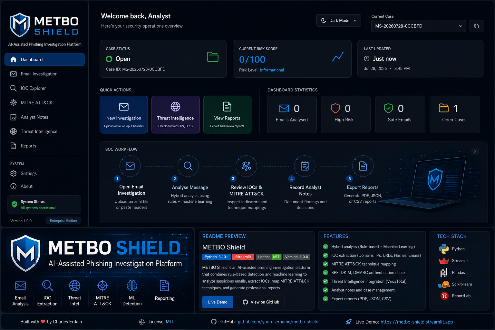
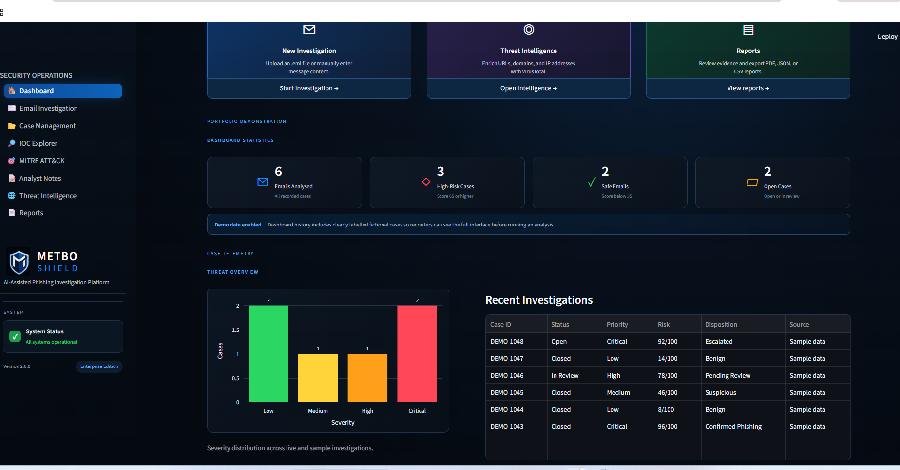
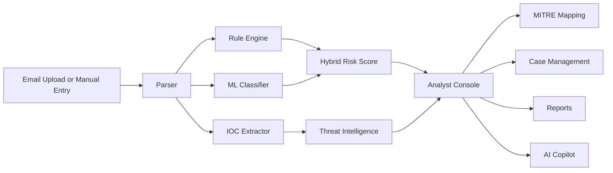

<p align="center">
  
</p>

<h1 align="center">METBO Shield</h1>
<p align="center"><strong>Enterprise Edition · Version 4.0.0</strong></p>
<p align="center">AI-assisted phishing investigation platform for SOC-style email analysis.</p>

<p align="center">
  
  
  
  
</p>

## Overview

METBO Shield combines an explainable phishing rule engine, a demonstration machine-learning classifier, IOC extraction, authentication analysis, MITRE ATT&CK mapping, threat-intelligence enrichment, case management, analyst notes, reporting, an evidence-grounded AI Copilot, and a polished SOC dashboard.

> **Important:** The ML component is trained on a small synthetic demonstration dataset. METBO Shield is a portfolio and educational project—not a production email-security gateway or a substitute for professional security controls.

## Screenshot

<p align="center">
  
</p>

## Core capabilities

- Upload and parse `.eml` files or enter email content manually
- Hybrid phishing score from deterministic rules and a demonstration ML model
- Explainable findings with risk classification and analyst recommendations
- SPF, DKIM, and DMARC review
- IOC extraction for URLs, domains, IP addresses, and email addresses
- MITRE ATT&CK mapping for observed phishing behaviours
- Optional VirusTotal enrichment
- Case queue, status, priority, disposition, notes, and session audit log
- AI Copilot summaries grounded in the active case evidence
- PDF, JSON, and CSV exports
- Fictional demo cases clearly labelled for portfolio demonstrations
- Docker, GitHub Actions CI, issue templates, security policy, and contribution guide

## Architecture



## Run locally

```bash
python -m venv .venv
```

Windows:

```powershell
.venv\Scripts\activate
python -m pip install --upgrade pip
pip install -r requirements.txt
streamlit run app.py
```

macOS/Linux:

```bash
source .venv/bin/activate
python -m pip install --upgrade pip
pip install -r requirements.txt
streamlit run app.py
```

Then open `http://localhost:8501`.

## Sample emails

- `sample_emails/credential_phish.eml`
- `sample_emails/legitimate.eml`

## VirusTotal configuration

Copy the example secrets file:

```bash
cp .streamlit/secrets.toml.example .streamlit/secrets.toml
```

Add your API key locally:

```toml
VIRUSTOTAL_API_KEY = "your-api-key"
```

Never commit `.streamlit/secrets.toml` or any real secret.

## Docker

```bash
docker build -t metbo-shield .
docker run --rm -p 8501:8501 metbo-shield
```

## Tests and quality checks

```bash
pip install -r requirements-dev.txt
ruff check .
pytest -q
```

GitHub Actions runs these checks automatically on pushes and pull requests.

## Deploy to Streamlit Community Cloud

1. Push this project to a public GitHub repository.
2. In Streamlit Community Cloud, select **Create app**.
3. Choose the repository, branch `main`, and entrypoint `app.py`.
4. Add `VIRUSTOTAL_API_KEY` under app secrets only when needed.
5. Deploy and verify the sample emails before sharing the link.

## Repository structure

```text
METBO-Shield/
├── .github/                 # CI and issue templates
├── .streamlit/              # Streamlit configuration
├── assets/                  # Branding and CSS
├── intel/                   # VirusTotal integration
├── ml/                      # Demonstration ML classifier
├── reports/                 # PDF report generation
├── sample_emails/           # Fictional test messages
├── screenshots/             # Portfolio screenshots
├── tests/                   # Automated tests
├── utils/                   # Parser, detector, IOC, MITRE, UI, session state
├── views/                   # Multipage analyst interface
├── app.py
├── Dockerfile
├── pyproject.toml
└── requirements.txt
```

## Responsible use and privacy

METBO Shield keeps case data in the current Streamlit browser session by default. Do not upload confidential production email into a public deployment. Remove personal information from screenshots, reports, issues, and sample data.

## Author

**Charles Erdain**  
Cybersecurity portfolio project focused on phishing analysis, SOC workflow, threat intelligence, and structured reporting.
